# MUTQEN Architecture Atlas

> 9 as-is diagrams derived from the code at commit `37313bf` (2026-09-14). Each is rendered from Mermaid (GitHub renders ```mermaid fences natively); the PlantUML source of each lives in [`../architecture/plantuml/`](../architecture/plantuml/) — paste into plantuml.com, the VS Code PlantUML extension, or a CI step to produce SVG/PNG. Diagrams marked **PROPOSED** describe a target state. Interactive edition: https://claude.ai/code/artifact/952dcb10-6619-423c-99c7-29d171c7c163 · companions: [Enterprise Audit](enterprise-audit.md) · [Flutter Blueprint](flutter-blueprint.md)

> **Modelling notes & inconsistencies found while modelling:** SOURCES READ (read-only): backend/routes/api.php, bootstrap/app.php, the four middleware classes, AuthController (login/OTP), StudentRequestController (full), CenterManagerController (toggleTeacherStatus, method list), StudentController (toggleStatus/changeTeacher), CenterController/ManagerManagementController/TeacherController toggleStatus, MessageController (scoping + send), MemorizationController/WeeklyTestController notify calls, AttendanceImportController scoping, ReportPdfController guard, InAppNotification, all 14 models, all 8 Support classes, ReportService signatures, all 34 migrations (schema replayed in order), config/sanctum.php (expiration 10080), config/cors.php, composer.json, routes/web.php + console.php, .env.example, frontend-html/js/config.js, api.js, auth.js, layout.js (60s poll), manifest.webmanifest, .cpanel.yml, backend/.htaccess, backend/public/.htaccess, DEPLOYMENT.md, n8n/README.md + code node + workflow node types, tests/ tree, _handoff2/untitled/README.md.

MODELLING DECISIONS / AMBIGUITIES RESOLVED
1. Mermaid L3 uses a flowchart with subgraphs (C4Component cannot lay out ~30 components legibly); PlantUML L3 uses C4_Component with Boundary groups. Bounded contexts are an analytical overlay - the code is one flat controller namespace.
2. mPDF, PhpSpreadsheet, Sanctum store and the DB notification channel are drawn as 'containers inside the API process' in L2 per the brief; strictly they are components.
3. Fingerprint device: no integration exists - drawn as an external system whose xlsx enters through a human upload via the web client.
4. n8n's channel is SMTP e-mail (emailSend node); it authenticates as a human admin/teacher via /api/auth/login (password stored in the workflow JSON). No service account or ability exists.
5. Flutter app, FCM, SMS gateway, queue worker, Redis, object storage, monitoring, VPS are dashed TARGET proposals only.
6. ERD omits Laravel infra tables (cache, cache_locks, jobs, job_batches, failed_jobs, sessions, password_reset_tokens). Polymorphic notifications/personal_access_tokens drawn as dotted, non-identifying to users (no DB FK).
7. Deployment: DEPLOYPATH /home/[redacted-cpanel-user]/public_html and LoginEmail::DOMAIN 'mutqin.ly' were used to name the host; PHP version (8.2) is from composer.json ^8.2, Apache version is not asserted.

INCONSISTENCIES / FINDINGS FOUND WHILE MODELLING (code, not CLAUDE.md)
A. Legacy type=add approval is effectively broken for new guardians: StudentRequestController::resolveParentId passes no 'password' key, and ParentResolver throws 422 'guardian password required' when it has to create a parent. student_requests has no guardian_password column. Only add rows whose guardian already exists (id_number/phone/email match) can be approved.
B. revisions and tajweed_evaluations still have teacher_id NOT NULL + ON DELETE CASCADE; attendances/memorizations/weekly_tests were migrated to nullable SET NULL (2026_07_02). Dormant tables, but inconsistent with the 'history preserved' rule.
C. student_requests.target_teacher_id: NOT NULL FK made nullable via ->change() (2026_09_08) - FK to users kept with default RESTRICT; target_center_id, from_center_id, from_teacher_id are RESTRICT; requested_by is CASCADE (a hard-deleted user would erase its requests - though no hard delete route exists).
D. weekly_tests final schema = exam_date + result (Arabic enum) + notes; test_type/passed were dropped in v2 and 'date' was renamed to exam_date and never renamed back. CLAUDE.md's description is stale.
E. code_sequences has 5 rows incl. 'parent' (2026_09_11) and User::creating reserves P{n} for parents; login accepts display codes (T/CA/P) case-insensitively or e-mail. CLAUDE.md says parents have no code.
F. OTP password reset is restricted to roles parent and teacher (AuthController whereIn) - center managers cannot self-reset; admin resets them via ManagerManagementController::update (recordPasswordChange('admin')). Admin has no reset path at all.
G. Login failure returns 422 with errors.email (not 401); unauthenticated protected calls return Laravel's default 401 {"message":"Unauthenticated."} outside the project envelope. api.js keys only on status 401.
H. Admin and teacher tokens carry the identical ability ['*']; only the role check separates admin routes from teacher routes. Admin passes the teacher gate but MessageController rejects admin (403) inside the controller, whereas ReportPdfController::student lets admin fetch any student. Admin cannot reach any /manager/* route (403 at middleware) - consistent with 'admin is not a party to requests'.
I. changeTeacher is under the manager gate yet re-checks isCenterManager() (redundant). CenterManagerMiddleware requires center_id non-null: a center_manager row without a center logs in fine but gets 403 on every manager route.
J. AttendanceImportController scoping: out-of-center students -> explicit error row; same-center students of another teacher -> silently ignored for a teacher (ignoredOther counter); manager imports the whole center; admin imports everything.
K. The 'only primary teacher cannot be deactivated' guard exists only on the manager path (toggleTeacherStatus), not on admin TeacherController::toggleStatus.
L. InAppNotification docblock lists six types; MessageController emits a seventh, message_received (links teacher/messages.html?student= / parent/messages.html?student=). manager_deactivated is sent only when pending incoming requests > 0.
M. No queue/scheduler: QUEUE_CONNECTION=database in .env.example but no ShouldQueue classes and routes/console.php has only 'inspire'. Notifications are synchronous inserts wrapped in try/catch.
N. Deployment gaps from .cpanel.yml: vendor/, .env, storage/ excluded -> composer install and env provisioning are manual host steps; no migrate/config:cache on deploy; no cron; backups manual. DEPLOYMENT.md says cors allowed_origins is ['*'] but config/cors.php reads from env (prod is same-origin anyway).
O. Test count: 38 Feature + 2 Unit files (40), not 20 (CLAUDE.md) or 39 (brief).
P. No DB unique index on users.phone/students.phone (MariaDB per-role unique impossible per DEPLOYMENT.md); guardian de-dup is enforced only by ParentResolver. students.national_id widened by raw ALTER (why sqlite tests cannot run).
Q. Frontend Auth.requireAuth() and the PWA manifest (no service worker) are UX-level; the design-system handoff (_handoff2) is a Claude Design HTML prototype bundle, not runtime code.

## Contents

1. [01 - C4 Level 1 - System Context (AS-IS)](#01-c4-level-1-system-context-as-is)
2. [02 - C4 Level 2 - Containers (AS-IS)](#02-c4-level-2-containers-as-is)
3. [03 - C4 Level 3 - API Components grouped by gate and bounded context (AS-IS)](#03-c4-level-3-api-components-grouped-by-gate-and-bounded-context-as-is)
4. [04 - ERD - all domain tables (final schema reconstructed from 34 migrations)](#04-erd-all-domain-tables-final-schema-reconstructed-from-34-migrations)
5. [05 - Sequence - Login with dual role + token-ability check, then a protected request](#05-sequence-login-with-dual-role-token-ability-check-then-a-protected-request)
6. [06 - Sequence - Student transfer request lifecycle (manager A -> manager B), incl. 403 for non-target manager](#06-sequence-student-transfer-request-lifecycle-manager-a-manager-b-incl-403-for-non-target-manager)
7. [07 - State - StudentRequest status, Student / User / Center active-inactive, Sanctum token, with revocation side effects](#07-state-studentrequest-status-student-user-center-active-inactive-sanctum-token-with-revocation-side-effects)
8. [08 - Deployment - cPanel shared host today + dashed TARGET (Flutter, FCM, queue worker, object storage, monitoring, SMS)](#08-deployment-cpanel-shared-host-today-dashed-target-flutter-fcm-queue-worker-object-storage-monitoring-sms)
9. [09 - PROPOSED TO-BE - modular monolith component diagram (bounded contexts)](#09-proposed-to-be-modular-monolith-component-diagram-bounded-contexts)

## 01 - C4 Level 1 - System Context (AS-IS)

_c4-context_ · PlantUML source: [`01-c4-level-1-system-context-as-is.puml`](../architecture/plantuml/01-c4-level-1-system-context-as-is.puml)

Actors = the four values of users.role (AuthController::login issues one token type per role). The fingerprint device has no integration: its xlsx is carried by a human and uploaded via AttendanceImportController, so it is drawn as an external system whose data enters through the web client. n8n is the only machine client and authenticates as a human (admin or teacher) via the same login endpoint - there is no service account or dedicated ability; its output channel is SMTP e-mail (n8n emailSend node), not push. Flutter app and SMS gateway are dashed/future: neither exists in the repo (sendOtp() only logs).

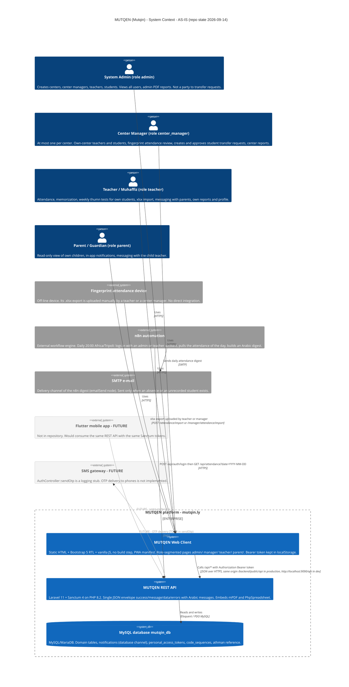

<details><summary>PlantUML source</summary>

```plantuml
@startuml MUTQEN_C4_L1_Context
!include https://raw.githubusercontent.com/plantuml-stdlib/C4-PlantUML/master/C4_Context.puml

LAYOUT_TOP_DOWN()
title MUTQEN (Mutqin) - C4 Level 1 - System Context - AS-IS (2026-09-14)

AddElementTag("future", $bgColor="#F4F4F4", $fontColor="#616161", $borderColor="#9E9E9E", $borderStyle=DashedLine(), $legendText="future / not in repository")
AddRelTag("future", $lineStyle=DashedLine(), $lineColor="#9E9E9E", $textColor="#9E9E9E", $legendText="future relation")

Person(admin, "System Admin", "role=admin. Creates centers, center managers, teachers, students; sees all users; admin PDF reports. Not a party to transfer requests.")
Person(manager, "Center Manager", "role=center_manager (max one per center). Own-center teachers/students, fingerprint review, transfer requests, center reports.")
Person(teacher, "Teacher (muhaffiz)", "role=teacher. Attendance, memorization, weekly thumn tests, xlsx import, parent messaging, own reports/profile.")
Person(parent, "Parent (guardian)", "role=parent. Read-only children view, in-app notifications, messaging with the child teacher.")

Enterprise_Boundary(mutqen, "MUTQEN platform - mutqin.ly") {
    System(web, "MUTQEN Web Client", "Static HTML + Bootstrap 5 RTL + vanilla JS (no build step), PWA manifest. Pages per role: admin/ manager/ teacher/ parent/. Token in localStorage (mutqin_token).")
    System(api, "MUTQEN REST API", "Laravel 11 + Sanctum 4, PHP 8.2. Envelope {success,message,data,errors}, Arabic validation messages. mPDF + PhpSpreadsheet embedded.")
    SystemDb(db, "MySQL mutqin_db", "MySQL/MariaDB. Domain tables, notifications (database channel), personal_access_tokens, code_sequences, athman reference.")
}

System_Ext(fpdev, "Fingerprint attendance device", "Off-line device. Its .xlsx export is uploaded manually by a teacher or a center manager. No direct integration.")
System_Ext(n8n, "n8n automation", "External workflow engine. Daily 20:00 Africa/Tripoli: login as admin/teacher, GET /api/attendance, Arabic digest.")
System_Ext(smtp, "SMTP e-mail", "Channel of the n8n digest (emailSend node), only when absence or unrecorded students exist.")
System_Ext(flutter, "Flutter mobile app", "Not in repository. Would consume the same REST API and Sanctum tokens.", $tags="future")
System_Ext(sms, "SMS gateway", "AuthController::sendOtp() is a logging stub - the OTP never leaves the server today.", $tags="future")

Rel(admin, web, "Uses", "HTTPS")
Rel(manager, web, "Uses", "HTTPS")
Rel(teacher, web, "Uses", "HTTPS")
Rel(parent, web, "Uses", "HTTPS")
Rel(web, api, "fetch /api/* with Authorization: Bearer", "JSON/HTTPS, same origin /backend/public/api in prod, localhost:9090 in dev")
Rel(api, db, "Eloquent / PDO", "MySQL")
Rel(fpdev, web, "xlsx export uploaded by user", "POST /attendance/import, /manager/attendance/import")
Rel(n8n, api, "POST /api/auth/login, GET /api/attendance?date=", "HTTPS")
Rel(n8n, smtp, "daily attendance digest", "SMTP")
Rel(flutter, api, "same endpoints", "HTTPS", $tags="future")
Rel(api, sms, "OTP delivery (TODO)", "SMS", $tags="future")

SHOW_LEGEND()
@enduml
```

</details>

## 02 - C4 Level 2 - Containers (AS-IS)

_c4-container_ · PlantUML source: [`02-c4-level-2-containers-as-is.puml`](../architecture/plantuml/02-c4-level-2-containers-as-is.puml)

Per the brief, mPDF, PhpSpreadsheet, the Sanctum token store and the database notification channel are drawn as containers 'inside the API process' (strict C4 would call them components) so the runtime dependencies are visible at L2. There is exactly one deployable PHP process; no queue worker, no scheduler (routes/console.php only has the default inspire command; no class implements ShouldQueue). config.js decides API_BASE_URL at runtime: localhost -> http://localhost:9090/api, otherwise relative /backend/public/api (same origin, so CORS is irrelevant in prod).

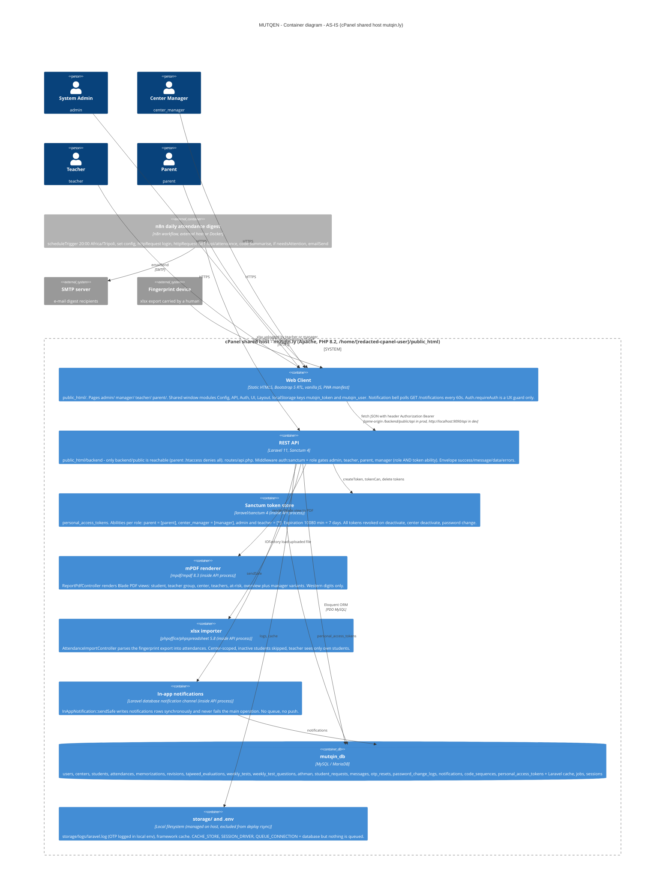

<details><summary>PlantUML source</summary>

```plantuml
@startuml MUTQEN_C4_L2_Containers
!include https://raw.githubusercontent.com/plantuml-stdlib/C4-PlantUML/master/C4_Container.puml

LAYOUT_TOP_DOWN()
title MUTQEN - C4 Level 2 - Containers - AS-IS (cPanel shared host mutqin.ly)

Person(admin, "System Admin", "admin")
Person(manager, "Center Manager", "center_manager")
Person(teacher, "Teacher", "teacher")
Person(parent, "Parent", "parent")

System_Boundary(host, "cPanel shared host - mutqin.ly (Apache 2.4, PHP 8.2, /home/[redacted-cpanel-user]/public_html)") {
    Container(web, "Web Client", "Static HTML5 + Bootstrap 5 RTL + vanilla JS, PWA manifest", "public_html/. Pages admin/ manager/ teacher/ parent/. window modules Config, API, Auth, UI, Layout. localStorage mutqin_token / mutqin_user. Bell polls /notifications every 60s. Auth.requireAuth is UX-only.")

    Container_Boundary(apiproc, "REST API process - public_html/backend (Laravel 11, PHP 8.2)") {
        Container(api, "API core", "Laravel 11, routes/api.php", "Middleware: throttle (public), auth:sanctum, role gates admin / teacher / parent / manager (role AND token ability). Envelope {success,message,data,errors}. Only backend/public is web-reachable (.htaccess).")
        Container(sanctum, "Sanctum tokens", "laravel/sanctum ^4.0", "personal_access_tokens. Abilities: parent=[parent], center_manager=[manager], admin+teacher=[*]. expiration 10080 min (7d). Revoked on deactivate / center deactivate / password change.")
        Container(pdf, "mPDF", "mpdf/mpdf ^8.3", "ReportPdfController: student, teacherGroup, center, teachers, atRisk, overview + managerCenter/managerAtRisk/managerTeachers. Western digits.")
        Container(xlsx, "PhpSpreadsheet", "phpoffice/phpspreadsheet ^5.8", "AttendanceImportController::import - fingerprint xlsx to attendances (center-scoped, inactive skipped).")
        Container(notif, "In-app notifications", "Laravel database channel", "InAppNotification::sendSafe - synchronous insert, swallows failures. No ShouldQueue, no push.")
    }

    ContainerDb(db, "mutqin_db", "MySQL / MariaDB", "17 domain/auth tables + Laravel cache, jobs, sessions, password_reset_tokens")
    Container(fs, "storage/ + .env", "Filesystem on host", "Excluded from deploy rsync; logs (OTP in local env); cache/session/queue drivers = database but nothing queued.")
}

Container_Ext(n8n, "n8n daily attendance digest", "n8n workflow (external host / Docker)", "scheduleTrigger 20:00 Africa/Tripoli -> set -> httpRequest login -> httpRequest GET /api/attendance -> code -> if needsAttention -> emailSend")
System_Ext(smtp, "SMTP server", "digest recipients")
System_Ext(fpdev, "Fingerprint device", "xlsx export carried by a human")

Rel(admin, web, "HTTPS")
Rel(manager, web, "HTTPS")
Rel(teacher, web, "HTTPS")
Rel(parent, web, "HTTPS")
Rel(web, api, "fetch JSON, Authorization: Bearer", "same-origin /backend/public/api (prod) or http://localhost:9090/api (dev)")
Rel(api, sanctum, "createToken / tokenCan / tokens()->delete()")
Rel(api, pdf, "render()")
Rel(api, xlsx, "IOFactory::load()")
Rel(api, notif, "sendSafe()")
Rel(api, db, "Eloquent ORM", "PDO MySQL")
Rel(sanctum, db, "personal_access_tokens")
Rel(notif, db, "notifications")
Rel(api, fs, "logs / cache")
Rel(n8n, api, "login + GET /api/attendance?date=", "HTTPS")
Rel(n8n, smtp, "emailSend", "SMTP")
Rel(fpdev, web, "xlsx uploaded by teacher or manager")

SHOW_LEGEND()
@enduml
```

</details>

## 03 - C4 Level 3 - API Components grouped by gate and bounded context (AS-IS)

_c4-component_ · PlantUML source: [`03-c4-level-3-api-components-grouped-by-gate-and-bounded-contex.puml`](../architecture/plantuml/03-c4-level-3-api-components-grouped-by-gate-and-bounded-contex.puml)

Mermaid version uses a flowchart with subgraphs (listed as allowed) because Mermaid C4Component cannot lay out ~30 components legibly; the PlantUML version uses C4_Component with Boundary groups. Grouping into bounded contexts is an analytical overlay - the code has a flat app/Http/Controllers/Api namespace. Gate assignment is taken from routes/api.php: StudentController is reached through four different gates, ReportPdfController and AttendanceImportController through two or three. Note the gate/controller asymmetries: admin passes the teacher gate yet MessageController returns 403 to admin inside; changeTeacher is under the manager gate but re-checks isCenterManager() (redundant); DisplayCode writes code_sequences directly with raw SQL, bypassing Eloquent.

```mermaid
flowchart TB
    classDef gate fill:#fff3e0,stroke:#ef6c00,color:#333
    classDef ctrl fill:#e3f2fd,stroke:#1565c0,color:#333
    classDef support fill:#f3e5f5,stroke:#6a1b9a,color:#333
    classDef svc fill:#e8f5e9,stroke:#2e7d32,color:#333
    classDef model fill:#fafafa,stroke:#757575,color:#333
    classDef ext fill:#eeeeee,stroke:#9e9e9e,color:#333

    WEB["Web Client / n8n<br/>JSON + Authorization Bearer"]:::ext

    subgraph MW["Middleware chain - aliases in bootstrap/app.php"]
        direction LR
        THR["throttle<br/>login 10/min, otp request 5/min, otp verify 10/min"]:::gate
        SANC["auth:sanctum<br/>token hash lookup + expires_at 7d<br/>fail = 401 Unauthenticated"]:::gate
        GADM["admin gate - AdminMiddleware<br/>isAdmin AND tokenCan('*')"]:::gate
        GTEA["teacher gate - TeacherMiddleware<br/>role in teacher,admin AND tokenCan('*')"]:::gate
        GPAR["parent gate - ParentMiddleware<br/>isParent AND tokenCan('parent')"]:::gate
        GMGR["manager gate - CenterManagerMiddleware<br/>isCenterManager AND tokenCan('manager') AND center_id not null"]:::gate
    end

    subgraph IAM["Identity and Access"]
        AUTHC["AuthController<br/>public: login (email or display_code), forgot-password request/verify<br/>auth: logout, user"]:::ctrl
        PROFC["TeacherProfileController - teacher gate<br/>show, updatePhone, changePassword (token owner only)"]:::ctrl
        ADMUC["AdminUserController - admin gate<br/>index (read-only user directory)"]:::ctrl
        MGMTC["ManagerManagementController - admin gate<br/>index, store, update, toggleStatus (one manager per center)"]:::ctrl
    end

    subgraph CST["Centers and Staff"]
        CENC["CenterController - admin gate<br/>index, store, show, update, toggleStatus, stats, teachers, students"]:::ctrl
        TEAC["TeacherController - admin gate<br/>index, store, show, update, toggleStatus, hasPrimary"]:::ctrl
        CMGC["CenterManagerController - manager gate<br/>dashboard, myCenter, otherCenters, teachers CRUD-no-delete, teacherNextCode, teacherPerformance, toggleTeacherStatus, parents, attendanceIndex, correctAttendance, reportsSystem, reportsManagement, reportCenter/Teacher/Student"]:::ctrl
    end

    subgraph STU["Students and Guardians"]
        STUC["StudentController<br/>admin: store, toggleStatus, nextCode, searchParents<br/>manager: index, store, nextCode, toggleStatus, changeTeacher, managerSearchParents<br/>teacher: index, show, update, teacherDetails, teacherDay<br/>parent: parentChildren, parentStudentDetails"]:::ctrl
    end

    subgraph ATT["Attendance"]
        ATTC["AttendanceController - teacher gate<br/>index, store, report"]:::ctrl
        IMPC["AttendanceImportController - teacher and manager gates<br/>import xlsx (center-scoped)"]:::ctrl
    end

    subgraph MEM["Memorization and Assessment"]
        MEMC["MemorizationController - teacher gate<br/>index, store, destroy, surahs, studentsProgress"]:::ctrl
        WTC["WeeklyTestController - teacher gate<br/>index, store, show, update (no destroy)"]:::ctrl
        ATHC["AthmanController - any authenticated<br/>search, hizb, show"]:::ctrl
    end

    subgraph REQ["Requests and Workflow"]
        SRQC["StudentRequestController - manager gate<br/>managerIndex, managerStore (transfer), approve, reject<br/>assertManagerScope = target center manager only"]:::ctrl
    end

    subgraph MSG["Messaging and Notifications"]
        MSGC["MessageController - parent and teacher gates<br/>threads, thread, send (admin rejected 403 inside)"]:::ctrl
        NOTC["NotificationController - any authenticated<br/>index, markRead, markAllRead"]:::ctrl
        INAPP["InAppNotification (database channel)<br/>sendSafe: request_created/approved/rejected, manager_deactivated, memorization_added, test_added, message_received"]:::svc
    end

    subgraph REP["Reporting"]
        DASHC["DashboardController<br/>public: publicStats, demoAccounts<br/>auth: index (role-aware)"]:::ctrl
        REPC["ReportController<br/>teacher: weekly, student<br/>admin: missingNationalId"]:::ctrl
        PDFC["ReportPdfController (mPDF)<br/>teacher: student, teacherGroup<br/>admin: center, teachers, atRisk, overview<br/>manager: managerCenter, managerAtRisk, managerTeachers"]:::ctrl
        REPS["ReportService<br/>studentData, teacherGroupData, centerData, allCentersData, teachersPerformance, atRiskStudents, progressSummary, centerManagement, overview, *AllTime"]:::svc
    end

    subgraph SUP["app/Support - shared kernel"]
        direction LR
        ARAB["ArabicText<br/>normalize, sqlNormalize"]:::support
        DCODE["DisplayCode<br/>preview, next (code_sequences, atomic)"]:::support
        LEMAIL["LoginEmail<br/>temporary, build, assign"]:::support
        PRES["ParentResolver<br/>id_number then phone then email, else create"]:::support
        PCT["Percentage"]:::support
        PHN["PhoneNumber<br/>normalize to 09xxxxxxxx"]:::support
        PTR["PrimaryTeacherRule<br/>one primary per center"]:::support
        SUR["SurahReference<br/>114 surahs to juz, progress, namesOfJuz"]:::support
    end

    MODELS["Eloquent models - app/Models<br/>User, Center, Student, StudentRequest, Message, Attendance, Memorization, Revision, TajweedEvaluation, WeeklyTest, WeeklyTestQuestion, OtpReset, PasswordChangeLog, Athman<br/>creating hooks reserve display codes"]:::model
    DB[("MySQL mutqin_db")]:::model

    WEB --> THR --> AUTHC
    WEB --> DASHC
    WEB --> SANC
    SANC --> AUTHC
    SANC --> DASHC
    SANC --> NOTC
    SANC --> ATHC
    SANC --> GADM
    SANC --> GTEA
    SANC --> GPAR
    SANC --> GMGR

    GADM --> TEAC
    GADM --> CENC
    GADM --> STUC
    GADM --> ADMUC
    GADM --> MGMTC
    GADM --> REPC
    GADM --> PDFC

    GTEA --> PROFC
    GTEA --> STUC
    GTEA --> MSGC
    GTEA --> ATTC
    GTEA --> IMPC
    GTEA --> MEMC
    GTEA --> WTC
    GTEA --> REPC
    GTEA --> PDFC

    GPAR --> STUC
    GPAR --> MSGC

    GMGR --> CMGC
    GMGR --> STUC
    GMGR --> IMPC
    GMGR --> PDFC
    GMGR --> SRQC

    AUTHC -.-> PHN
    STUC -.-> PRES
    STUC -.-> ARAB
    STUC -.-> DCODE
    PRES -.-> PHN
    PRES -.-> LEMAIL
    MGMTC -.-> LEMAIL
    TEAC -.-> PTR
    CMGC -.-> PTR
    TEAC -.-> ARAB
    MEMC -.-> SUR
    REPS -.-> SUR
    REPS -.-> PCT
    REPC --> REPS
    PDFC --> REPS
    CMGC --> REPS
    DASHC --> REPS

    SRQC -.-> INAPP
    MGMTC -.-> INAPP
    MEMC -.-> INAPP
    WTC -.-> INAPP
    MSGC -.-> INAPP
    SRQC -.-> PRES

    IAM --> MODELS
    CST --> MODELS
    STU --> MODELS
    ATT --> MODELS
    MEM --> MODELS
    REQ --> MODELS
    MSG --> MODELS
    REP --> MODELS
    MODELS --> DB
```

<details><summary>PlantUML source</summary>

```plantuml
@startuml MUTQEN_C4_L3_API_Components
!include https://raw.githubusercontent.com/plantuml-stdlib/C4-PlantUML/master/C4_Component.puml

LAYOUT_TOP_DOWN()
title MUTQEN REST API - C4 Level 3 - Components by gate and bounded context - AS-IS

Container(web, "Web Client / n8n", "HTTPS JSON", "Authorization: Bearer token")
ContainerDb(db, "mutqin_db", "MySQL", "")

Container_Boundary(api, "REST API - Laravel 11 (backend/app)") {

    Boundary(mw, "Middleware chain (bootstrap/app.php aliases)") {
        Component(thr, "throttle", "Laravel", "login 10/min, otp request 5/min, otp verify 10/min (per IP)")
        Component(sanc, "auth:sanctum", "Sanctum guard", "token hash lookup, expires_at (7d). Fail -> 401 Unauthenticated (framework JSON)")
        Component(gadm, "admin gate", "AdminMiddleware", "isAdmin() AND tokenCan('*') else 403")
        Component(gtea, "teacher gate", "TeacherMiddleware", "role in [teacher, admin] AND tokenCan('*') else 403")
        Component(gpar, "parent gate", "ParentMiddleware", "isParent() AND tokenCan('parent') else 403")
        Component(gmgr, "manager gate", "CenterManagerMiddleware", "isCenterManager() AND tokenCan('manager') AND center_id else 403")
    }

    Boundary(iam, "Identity & Access") {
        Component(authc, "AuthController", "public + auth", "login (email or display_code), forgotPasswordRequest/Verify (parent, teacher only), logout, user")
        Component(profc, "TeacherProfileController", "teacher gate", "show, updatePhone, changePassword (token owner only)")
        Component(admuc, "AdminUserController", "admin gate", "index - read-only user directory")
        Component(mgmtc, "ManagerManagementController", "admin gate", "index, store, update, toggleStatus - one manager per center, {latin}.centeradmin@mutqin.ly")
    }

    Boundary(cst, "Centers & Staff") {
        Component(cenc, "CenterController", "admin gate", "index, store, show, update, toggleStatus (revokes members tokens), stats, teachers, students")
        Component(teac, "TeacherController", "admin gate", "index, store, show, update, toggleStatus, hasPrimary")
        Component(cmgc, "CenterManagerController", "manager gate", "dashboard, myCenter, otherCenters, teachers/showTeacher/storeTeacher/updateTeacher/toggleTeacherStatus/teacherNextCode/teacherPerformance, parents, attendanceIndex, correctAttendance, reportsSystem/Management, reportCenter/Teacher/Student")
    }

    Boundary(stu, "Students & Guardians") {
        Component(stuc, "StudentController", "admin / manager / teacher / parent gates", "store, index, show, update, toggleStatus, changeTeacher, nextCode, searchParents, managerSearchParents, teacherDetails, teacherDay, parentChildren, parentStudentDetails")
    }

    Boundary(att, "Attendance") {
        Component(attc, "AttendanceController", "teacher gate", "index, store, report (active students only)")
        Component(impc, "AttendanceImportController", "teacher + manager gates", "import xlsx - center-scoped; teacher: only own students, others silently ignored")
    }

    Boundary(mem, "Memorization & Assessment") {
        Component(memc, "MemorizationController", "teacher gate", "index (?juz via SurahReference), store, destroy, surahs, studentsProgress")
        Component(wtc, "WeeklyTestController", "teacher gate", "index, store, show, update - no destroy")
        Component(athc, "AthmanController", "auth", "search, hizb, show (read-only thumn index)")
    }

    Boundary(req, "Requests & Workflow") {
        Component(srqc, "StudentRequestController", "manager gate", "managerIndex, managerStore (transfer only), approve, reject; assertManagerScope = target-center manager only")
    }

    Boundary(msg, "Messaging & Notifications") {
        Component(msgc, "MessageController", "parent + teacher gates", "threads, thread, send - parent of student / actual teacher only; admin -> 403")
        Component(notc, "NotificationController", "auth", "index, markRead, markAllRead")
        Component(inapp, "InAppNotification", "Notification, database channel", "sendSafe(); types: request_created/approved/rejected, manager_deactivated, memorization_added, test_added, message_received")
    }

    Boundary(rep, "Reporting") {
        Component(dashc, "DashboardController", "public + auth", "publicStats, demoAccounts (local/debug only), index role-aware")
        Component(repc, "ReportController", "teacher + admin gates", "weekly, student, missingNationalId")
        Component(pdfc, "ReportPdfController", "teacher/admin/manager gates, mPDF", "student, teacherGroup, center, teachers, atRisk, overview, managerCenter, managerAtRisk, managerTeachers")
        Component(reps, "ReportService", "app/Services", "studentData, teacherGroupData, centerData, allCentersData, teachersPerformance, atRiskStudents, progressSummary, centerManagement, overview, *AllTime")
    }

    Boundary(sup, "app/Support - shared kernel") {
        Component(arab, "ArabicText", "static", "stripTashkeel, normalize, normalizeQuery, sqlNormalize")
        Component(dcode, "DisplayCode", "static", "preview/next - code_sequences S/T/CA/P/C, atomic LAST_INSERT_ID")
        Component(lemail, "LoginEmail", "static", "temporary(), build(latin, code)@mutqin.ly, assign()")
        Component(pres, "ParentResolver", "static", "id_number -> phone -> email -> create parent (random/required password)")
        Component(phn, "PhoneNumber", "static", "normalize +218/00218/Arabic digits -> 09xxxxxxxx")
        Component(ptr, "PrimaryTeacherRule", "static", "assert one primary teacher per center")
        Component(sur, "SurahReference", "static", "114 surahs -> juz; progress(), namesOfJuz(), juzRangeOf()")
        Component(pct, "Percentage", "static", "of(part,total)")
    }

    Component(models, "Eloquent models", "app/Models (14)", "User, Center, Student, StudentRequest, Message, Attendance, Memorization, Revision, TajweedEvaluation, WeeklyTest, WeeklyTestQuestion, OtpReset, PasswordChangeLog, Athman. creating hooks reserve display codes.")
}

Rel(web, thr, "POST /auth/login, /auth/forgot-password/*")
Rel(web, sanc, "all other /api/* with Bearer")
Rel(thr, authc, "")
Rel(sanc, gadm, "")
Rel(sanc, gtea, "")
Rel(sanc, gpar, "")
Rel(sanc, gmgr, "")
Rel(sanc, notc, "auth only")
Rel(sanc, athc, "auth only")
Rel(sanc, dashc, "auth only")
Rel(gadm, teac, "")
Rel(gadm, cenc, "")
Rel(gadm, stuc, "")
Rel(gadm, admuc, "")
Rel(gadm, mgmtc, "")
Rel(gadm, repc, "")
Rel(gadm, pdfc, "")
Rel(gtea, profc, "")
Rel(gtea, stuc, "")
Rel(gtea, msgc, "")
Rel(gtea, attc, "")
Rel(gtea, impc, "")
Rel(gtea, memc, "")
Rel(gtea, wtc, "")
Rel(gtea, repc, "")
Rel(gtea, pdfc, "")
Rel(gpar, stuc, "")
Rel(gpar, msgc, "")
Rel(gmgr, cmgc, "")
Rel(gmgr, stuc, "")
Rel(gmgr, impc, "")
Rel(gmgr, pdfc, "")
Rel(gmgr, srqc, "")

Rel(authc, phn, "")
Rel(stuc, pres, "")
Rel(stuc, arab, "")
Rel(srqc, pres, "legacy add approval")
Rel(pres, phn, "")
Rel(pres, lemail, "")
Rel(mgmtc, lemail, "")
Rel(teac, ptr, "")
Rel(cmgc, ptr, "lockForUpdate")
Rel(memc, sur, "")
Rel(reps, sur, "")
Rel(reps, pct, "")
Rel(repc, reps, "")
Rel(pdfc, reps, "")
Rel(cmgc, reps, "")
Rel(dashc, reps, "")
Rel(srqc, inapp, "")
Rel(mgmtc, inapp, "")
Rel(memc, inapp, "")
Rel(wtc, inapp, "")
Rel(msgc, inapp, "")
Rel(models, db, "Eloquent")
Rel(dcode, db, "code_sequences")
Rel(inapp, db, "notifications")

SHOW_LEGEND()
@enduml
```

</details>

## 04 - ERD - all domain tables (final schema reconstructed from 34 migrations)

_erd_ · PlantUML source: [`04-erd-all-domain-tables-final-schema-reconstructed-from-34-mig.puml`](../architecture/plantuml/04-erd-all-domain-tables-final-schema-reconstructed-from-34-mig.puml)

Columns and constraints were reconstructed by replaying all 34 migration files in order (not from CLAUDE.md). Notable findings: (1) weekly_tests final columns are exam_date + result (Arabic enum) - test_type and passed were DROPPED in v2 and date was renamed to exam_date and never renamed back, so CLAUDE.md's 'overlapping result+passed+test_type' is stale. (2) teacher_id was made nullable/SET NULL only on attendances, memorizations, weekly_tests (2026_07_02); revisions and tajweed_evaluations still have NOT NULL teacher_id with CASCADE delete - inconsistent, but dormant tables. (3) student_requests.target_teacher_id was NOT NULL FK then ->change()d to nullable (2026_09_08); its FK to users survives with default RESTRICT, as do target_center_id, from_center_id, from_teacher_id; requested_by is CASCADE. (4) notifications and personal_access_tokens are polymorphic (notifiable_*, tokenable_*) with no DB FK - drawn dotted. (5) athman and code_sequences have no relationships; code_sequences.name PK has 5 rows (student, teacher, center_manager, center, parent - parent added 2026-09-11, so parents now get P{n} codes, contrary to CLAUDE.md). (6) users.type stores Arabic enum literals; users.role is a free string (no CHECK). (7) students.national_id widened with a raw MySQL ALTER (blocks sqlite tests). (8) No unique index on users.phone or students.phone; guardian de-dup is application-level (ParentResolver). Laravel infra tables (cache, cache_locks, jobs, job_batches, failed_jobs, sessions, password_reset_tokens) are omitted from the ERD.

```mermaid
erDiagram
    users {
        bigint id PK
        varchar name
        varchar display_code UK "T n teacher, CA n center_manager, P n parent; NULL for admin; nullable"
        varchar email UK "login id; parents get latin_code@mutqin.ly via LoginEmail"
        varchar phone "normalized 09xxxxxxxx; no unique index"
        varchar role "admin | center_manager | teacher | parent - plain string since 2026-06-20, default teacher"
        timestamp email_verified_at
        varchar password "bcrypt"
        int password_changed_count "default 0"
        timestamp password_last_changed_at
        varchar remember_token
        bigint center_id FK "nullable, centers.id, ON DELETE SET NULL - teacher and center_manager only"
        enum type "Arabic literals: primary muhaffiz | assistant muhaffiz; nullable"
        boolean is_active "default true"
        bigint status_changed_by FK "nullable, users.id, SET NULL"
        timestamp status_changed_at
        enum nationality_type "libyan | foreigner, default libyan"
        varchar nationality_name
        varchar id_number UK "nullable; guardian unified identifier"
        timestamp created_at
        timestamp updated_at
    }

    centers {
        bigint id PK
        varchar name
        varchar display_code UK "C n; nullable"
        varchar city
        varchar address
        varchar phone
        boolean is_active "default true"
        timestamp created_at
        timestamp updated_at
    }

    students {
        bigint id PK
        varchar name
        varchar display_code UK "S n; nullable"
        date birth_date "vestigial - age is used"
        varchar phone
        varchar national_id UK "nullable; widened to 32 by raw ALTER"
        enum nationality_type "libyan | foreigner"
        varchar nationality_name
        int age
        varchar guardian_name "display only"
        varchar guardian_phone "display only"
        bigint center_id FK "nullable, centers.id, SET NULL"
        bigint teacher_id FK "nullable, users.id, SET NULL - NULL = without teacher"
        varchar former_teacher_name
        bigint parent_id FK "nullable, users.id, SET NULL - real guardian link"
        date enrollment_date
        boolean is_active "default true"
        bigint status_changed_by FK "nullable, users.id, SET NULL"
        timestamp status_changed_at
        timestamp created_at
        timestamp updated_at
    }

    attendances {
        bigint id PK
        bigint student_id FK "students.id CASCADE; UNIQUE(student_id, date)"
        bigint teacher_id FK "nullable, users.id, SET NULL (since 2026-07-02)"
        bigint center_id FK "nullable, centers.id, SET NULL"
        date date
        varchar time "from fingerprint export"
        enum status "present | absent | late, default present"
        text notes
        timestamp imported_at "set by xlsx import"
        bigint corrected_by FK "nullable, users.id, SET NULL"
        timestamp corrected_at
        timestamp created_at
        timestamp updated_at
    }

    memorizations {
        bigint id PK
        bigint student_id FK "students.id CASCADE"
        bigint teacher_id FK "nullable, users.id, SET NULL"
        date date
        varchar surah_name "source of truth for juz via SurahReference"
        int juz "unreliable hand-entered"
        int hizb
        int page_from
        int page_to
        varchar eighth
        enum quality "excellent | good | average | weak"
        text notes
        timestamp created_at
        timestamp updated_at
    }

    revisions {
        bigint id PK
        bigint student_id FK "students.id CASCADE"
        bigint teacher_id FK "NOT NULL, users.id CASCADE - never migrated to SET NULL"
        date date
        varchar surah_name
        int page_from
        int page_to
        enum quality "excellent | good | average | weak"
        text notes
        timestamp created_at
        timestamp updated_at
    }

    tajweed_evaluations {
        bigint id PK
        bigint student_id FK "students.id CASCADE"
        bigint teacher_id FK "NOT NULL, users.id CASCADE - never migrated to SET NULL"
        date date
        int makharij_score
        int sifat_score
        int madd_score
        int waqf_score
        int total_score "computed in model saving hook"
        text notes
        timestamp created_at
        timestamp updated_at
    }

    weekly_tests {
        bigint id PK
        bigint student_id FK "students.id CASCADE"
        bigint teacher_id FK "nullable, users.id, SET NULL"
        enum result "Arabic literals pass | fail, default pass"
        date exam_date "renamed from date in v2, never renamed back"
        text notes
        timestamp created_at
        timestamp updated_at
    }

    weekly_test_questions {
        bigint id PK
        bigint weekly_test_id FK "weekly_tests.id CASCADE"
        bigint student_id FK "students.id CASCADE - denormalized"
        varchar eighth_start "thumn opening text"
        enum result "Arabic literals pass | fail"
        text mistake
        timestamp created_at
        timestamp updated_at
    }

    athman {
        bigint id PK
        tinyint hizb "1..60; UNIQUE(hizb, thumn_in_hizb)"
        tinyint thumn_in_hizb "1..8"
        smallint global_order "1..477, indexed"
        varchar surah_name "indexed; covers 92 surahs only"
        text start_text
        text start_text_norm "normalized for search"
        smallint page
        timestamp created_at
        timestamp updated_at
    }

    student_requests {
        bigint id PK
        enum type "add (legacy) | transfer"
        enum status "pending | approved | rejected, indexed"
        bigint requested_by FK "users.id CASCADE"
        bigint target_center_id FK "centers.id, RESTRICT"
        bigint target_teacher_id FK "nullable since 2026-09-08, users.id, RESTRICT"
        bigint student_id FK "nullable, students.id, SET NULL - set for transfer, filled on add approval"
        varchar national_id "snapshot, indexed"
        enum nationality_type
        varchar nationality_name
        varchar student_name "snapshot"
        int age
        varchar phone
        varchar guardian_name
        varchar guardian_phone
        varchar guardian_email
        enum guardian_nationality_type
        varchar guardian_nationality_name
        varchar guardian_id_number
        bigint from_center_id FK "nullable, centers.id, RESTRICT"
        bigint from_teacher_id FK "nullable, users.id, RESTRICT"
        text admin_note "rejection reason"
        timestamp created_at
        timestamp updated_at
    }

    otp_resets {
        bigint id PK
        bigint user_id FK "users.id CASCADE, indexed - one active row per user"
        varchar otp_hash "bcrypt of 6 digits"
        timestamp expires_at "now + 10 min"
        tinyint attempts "max 5"
        timestamp created_at
        timestamp updated_at
    }

    password_change_logs {
        bigint id PK
        bigint user_id FK "users.id CASCADE, indexed"
        timestamp changed_at
        enum method "otp | self | admin"
        timestamp created_at
        timestamp updated_at
    }

    notifications {
        uuid id PK
        varchar type "App-Notifications-InAppNotification class name"
        varchar notifiable_type "morph - App-Models-User, no FK"
        bigint notifiable_id "morph, indexed with type"
        text data "JSON: type, title, body, ref_id, link"
        timestamp read_at
        timestamp created_at
        timestamp updated_at
    }

    messages {
        bigint id PK
        bigint student_id FK "students.id CASCADE; idx(student_id,id); idx(student_id,sender_role,read_at)"
        bigint sender_id FK "users.id CASCADE"
        varchar sender_role "parent | teacher - denormalized, 16 chars"
        text body
        timestamp read_at "read by the other party"
        timestamp created_at
        timestamp updated_at
    }

    code_sequences {
        varchar name PK "student | teacher | center_manager | center | parent"
        bigint value "last reserved number, default 0"
    }

    personal_access_tokens {
        bigint id PK
        varchar tokenable_type "morph - App-Models-User, no FK"
        bigint tokenable_id "morph, indexed with type"
        text name "auth_token"
        varchar token UK "sha256, 64 chars"
        text abilities "JSON: [*] | [parent] | [manager]"
        timestamp last_used_at
        timestamp expires_at "indexed; now + 10080 min"
        timestamp created_at
        timestamp updated_at
    }

    centers |o--o{ users : "center_id"
    users |o--o{ users : "status_changed_by"
    centers |o--o{ students : "center_id"
    users |o--o{ students : "teacher_id"
    users |o--o{ students : "parent_id"
    users |o--o{ students : "status_changed_by"
    students ||--o{ attendances : "student_id"
    users |o--o{ attendances : "teacher_id"
    centers |o--o{ attendances : "center_id"
    users |o--o{ attendances : "corrected_by"
    students ||--o{ memorizations : "student_id"
    users |o--o{ memorizations : "teacher_id"
    students ||--o{ revisions : "student_id"
    users ||--o{ revisions : "teacher_id"
    students ||--o{ tajweed_evaluations : "student_id"
    users ||--o{ tajweed_evaluations : "teacher_id"
    students ||--o{ weekly_tests : "student_id"
    users |o--o{ weekly_tests : "teacher_id"
    weekly_tests ||--o{ weekly_test_questions : "weekly_test_id"
    students ||--o{ weekly_test_questions : "student_id"
    users ||--o{ student_requests : "requested_by"
    centers ||--o{ student_requests : "target_center_id"
    users |o--o{ student_requests : "target_teacher_id"
    students |o--o{ student_requests : "student_id"
    centers |o--o{ student_requests : "from_center_id"
    users |o--o{ student_requests : "from_teacher_id"
    users ||--o{ otp_resets : "user_id"
    users ||--o{ password_change_logs : "user_id"
    students ||--o{ messages : "student_id"
    users ||--o{ messages : "sender_id"
    users ||..o{ notifications : "notifiable morph - no FK"
    users ||..o{ personal_access_tokens : "tokenable morph - no FK"
```

<details><summary>PlantUML source</summary>

```plantuml
@startuml MUTQEN_ERD
hide circle
skinparam linetype ortho
skinparam classFontSize 10
skinparam classAttributeFontSize 9
title MUTQEN - ERD (final schema reconstructed from backend/database/migrations, 34 files, up to 2026_09_11)

entity "users" as users {
  * id : bigint <<PK>>
  --
  * name : varchar
  display_code : varchar(20) <<UK>> T{n}/CA{n}/P{n}, NULL admin
  * email : varchar <<UK>>
  phone : varchar (normalized, no unique idx)
  * role : varchar  admin|center_manager|teacher|parent
  email_verified_at : timestamp
  * password : [redacted]
  * password_changed_count : int = 0
  password_last_changed_at : timestamp
  remember_token : varchar
  center_id : bigint <<FK centers, SET NULL>>
  type : enum(Arabic: primary|assistant muhaffiz)
  * is_active : bool = true
  status_changed_by : bigint <<FK users, SET NULL>>
  status_changed_at : timestamp
  * nationality_type : enum libyan|foreigner
  nationality_name : varchar(100)
  id_number : varchar(32) <<UK>>
  created_at / updated_at
}

entity "centers" as centers {
  * id : bigint <<PK>>
  --
  * name : varchar
  display_code : varchar(20) <<UK>> C{n}
  city, address, phone : varchar
  * is_active : bool = true
  created_at / updated_at
}

entity "students" as students {
  * id : bigint <<PK>>
  --
  * name : varchar
  display_code : varchar(20) <<UK>> S{n}
  birth_date : date (vestigial)
  phone : varchar
  national_id : varchar(32) <<UK>> (raw ALTER)
  * nationality_type : enum libyan|foreigner
  nationality_name : varchar(100)
  age : int
  guardian_name, guardian_phone : varchar (display only)
  center_id : bigint <<FK centers, SET NULL>>
  teacher_id : bigint <<FK users, SET NULL>>
  former_teacher_name : varchar
  parent_id : bigint <<FK users, SET NULL>>
  enrollment_date : date
  * is_active : bool = true
  status_changed_by : bigint <<FK users, SET NULL>>
  status_changed_at : timestamp
  created_at / updated_at
}

entity "attendances" as attendances {
  * id : bigint <<PK>>
  --
  * student_id : bigint <<FK students, CASCADE>>
  teacher_id : bigint <<FK users, SET NULL>>
  center_id : bigint <<FK centers, SET NULL>>
  * date : date
  time : varchar
  * status : enum present|absent|late
  notes : text
  imported_at : timestamp
  corrected_by : bigint <<FK users, SET NULL>>
  corrected_at : timestamp
  created_at / updated_at
  ..
  UNIQUE(student_id, date)
}

entity "memorizations" as memorizations {
  * id : bigint <<PK>>
  --
  * student_id : bigint <<FK students, CASCADE>>
  teacher_id : bigint <<FK users, SET NULL>>
  * date : date
  * surah_name : varchar (juz source of truth)
  juz : int (unreliable)
  hizb, page_from, page_to : int
  eighth : varchar
  * quality : enum excellent|good|average|weak
  notes : text
  created_at / updated_at
}

entity "revisions" as revisions {
  * id : bigint <<PK>>
  --
  * student_id : bigint <<FK students, CASCADE>>
  * teacher_id : bigint <<FK users, CASCADE>> (NOT NULL!)
  * date : date
  * surah_name : varchar
  page_from, page_to : int
  * quality : enum
  notes : text
  created_at / updated_at
}

entity "tajweed_evaluations" as tajweed {
  * id : bigint <<PK>>
  --
  * student_id : bigint <<FK students, CASCADE>>
  * teacher_id : bigint <<FK users, CASCADE>> (NOT NULL!)
  * date : date
  makharij_score, sifat_score, madd_score, waqf_score : int
  total_score : int (model hook)
  notes : text
  created_at / updated_at
}

entity "weekly_tests" as weekly_tests {
  * id : bigint <<PK>>
  --
  * student_id : bigint <<FK students, CASCADE>>
  teacher_id : bigint <<FK users, SET NULL>>
  * result : enum (Arabic pass|fail)
  * exam_date : date
  notes : text
  created_at / updated_at
}

entity "weekly_test_questions" as wtq {
  * id : bigint <<PK>>
  --
  * weekly_test_id : bigint <<FK weekly_tests, CASCADE>>
  * student_id : bigint <<FK students, CASCADE>>
  * eighth_start : varchar
  * result : enum (Arabic pass|fail)
  mistake : text
  created_at / updated_at
}

entity "athman" as athman {
  * id : bigint <<PK>>
  --
  * hizb : tinyint 1..60
  * thumn_in_hizb : tinyint 1..8
  * global_order : smallint 1..477 (idx)
  * surah_name : varchar (idx)
  * start_text, start_text_norm : text
  page : smallint
  created_at / updated_at
  ..
  UNIQUE(hizb, thumn_in_hizb) - no FKs
}

entity "student_requests" as sreq {
  * id : bigint <<PK>>
  --
  * type : enum add|transfer
  * status : enum pending|approved|rejected (idx)
  * requested_by : bigint <<FK users, CASCADE>>
  * target_center_id : bigint <<FK centers, RESTRICT>>
  target_teacher_id : bigint <<FK users, RESTRICT>> (nullable 2026-09-08)
  student_id : bigint <<FK students, SET NULL>>
  national_id : varchar(12) (idx)
  nationality_type, nationality_name
  student_name, age, phone
  guardian_name, guardian_phone, guardian_email
  guardian_nationality_type, guardian_nationality_name, guardian_id_number
  from_center_id : bigint <<FK centers, RESTRICT>>
  from_teacher_id : bigint <<FK users, RESTRICT>>
  admin_note : text
  created_at / updated_at
}

entity "otp_resets" as otp {
  * id : bigint <<PK>>
  --
  * user_id : bigint <<FK users, CASCADE>> (idx)
  * otp_hash : varchar
  * expires_at : timestamp (+10 min)
  * attempts : tinyint (max 5)
  created_at / updated_at
}

entity "password_change_logs" as pcl {
  * id : bigint <<PK>>
  --
  * user_id : bigint <<FK users, CASCADE>> (idx)
  * changed_at : timestamp
  * method : enum otp|self|admin
  created_at / updated_at
}

entity "notifications" as notifications {
  * id : uuid <<PK>>
  --
  * type : varchar (InAppNotification)
  * notifiable_type : varchar (morph, no FK)
  * notifiable_id : bigint (morph)
  * data : text JSON {type,title,body,ref_id,link}
  read_at : timestamp
  created_at / updated_at
}

entity "messages" as messages {
  * id : bigint <<PK>>
  --
  * student_id : bigint <<FK students, CASCADE>>
  * sender_id : bigint <<FK users, CASCADE>>
  * sender_role : varchar(16) parent|teacher
  * body : text
  read_at : timestamp
  created_at / updated_at
  ..
  idx(student_id,id), idx(student_id,sender_role,read_at)
}

entity "code_sequences" as codeseq {
  * name : varchar(40) <<PK>> student|teacher|center_manager|center|parent
  --
  * value : bigint = 0
}

entity "personal_access_tokens" as pat {
  * id : bigint <<PK>>
  --
  * tokenable_type : varchar (morph, no FK)
  * tokenable_id : bigint (morph)
  * name : text = auth_token
  * token : varchar(64) <<UK>>
  abilities : text JSON [*]|[parent]|[manager]
  last_used_at : timestamp
  expires_at : timestamp (idx, +7d)
  created_at / updated_at
}

centers |o--o{ users : center_id
users |o--o{ users : status_changed_by
centers |o--o{ students : center_id
users |o--o{ students : teacher_id
users |o--o{ students : parent_id
users |o--o{ students : status_changed_by
students ||--o{ attendances : student_id
users |o--o{ attendances : teacher_id
centers |o--o{ attendances : center_id
users |o--o{ attendances : corrected_by
students ||--o{ memorizations : student_id
users |o--o{ memorizations : teacher_id
students ||--o{ revisions : student_id
users ||--o{ revisions : teacher_id
students ||--o{ tajweed : student_id
users ||--o{ tajweed : teacher_id
students ||--o{ weekly_tests : student_id
users |o--o{ weekly_tests : teacher_id
weekly_tests ||--o{ wtq : weekly_test_id
students ||--o{ wtq : student_id
users ||--o{ sreq : requested_by
centers ||--o{ sreq : target_center_id
users |o--o{ sreq : target_teacher_id
students |o--o{ sreq : student_id
centers |o--o{ sreq : from_center_id
users |o--o{ sreq : from_teacher_id
users ||--o{ otp : user_id
users ||--o{ pcl : user_id
students ||--o{ messages : student_id
users ||--o{ messages : sender_id
users ||..o{ notifications : notifiable (morph, no FK)
users ||..o{ pat : tokenable (morph, no FK)

note bottom of athman
  Standalone reference index (477 athman, 92 surahs, no juz column).
  code_sequences is also standalone: written by DisplayCode::next() with raw SQL.
end note
@enduml
```

</details>

## 05 - Sequence - Login with dual role + token-ability check, then a protected request

_sequence_ · PlantUML source: [`05-sequence-login-with-dual-role-token-ability-check-then-a-pro.puml`](../architecture/plantuml/05-sequence-login-with-dual-role-token-ability-check-then-a-pro.puml)

Facts checked in code: login accepts a display code (T1/CA1/P1, case-insensitive) or e-mail in the same 'email' field; wrong credentials return 422 (not 401); inactive-account and inactive-center checks run AFTER the password check and return 403; abilities are ['parent'], ['manager'] or ['*'] - admin and teacher tokens are indistinguishable by ability, only the role check separates them. Unauthenticated requests get Laravel's default 401 JSON (not the project envelope); api.js keys on the status code only. Token lifetime 10080 min (config/sanctum.php). Frontend Auth.requireAuth() only reads the role from localStorage and redirects - it is UX, not security.

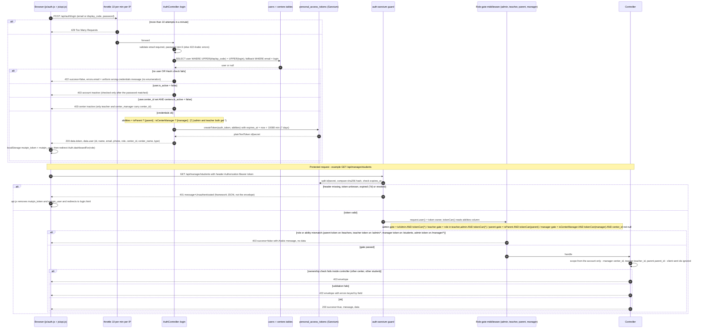

<details><summary>PlantUML source</summary>

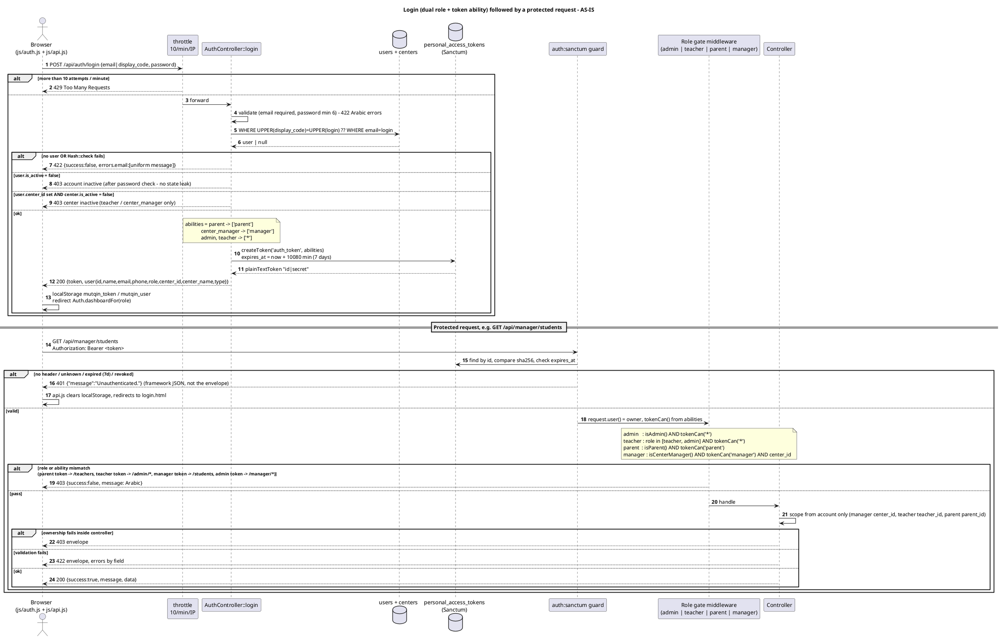

</details>

## 06 - Sequence - Student transfer request lifecycle (manager A -> manager B), incl. 403 for non-target manager

_sequence_ · PlantUML source: [`06-sequence-student-transfer-request-lifecycle-manager-a-manage.puml`](../architecture/plantuml/06-sequence-student-transfer-request-lifecycle-manager-a-manage.puml)

Derived from StudentRequestController::managerStore/approve/reject/assertManagerScope and CenterManagerMiddleware. The target manager is resolved at creation time as the single active center_manager of center B (activeManagerOf); at approval time scope is by target_center_id == caller.center_id, so any *later* active manager of B can also approve. The requester link is manager/requests.html when the requester is a center manager, teacher/students.html for legacy teacher-created add rows. Ambiguity resolved: the '403 for non-target manager' branch has two layers - non-managers are stopped by the middleware, other-center managers (including the source manager A) by assertManagerScope.

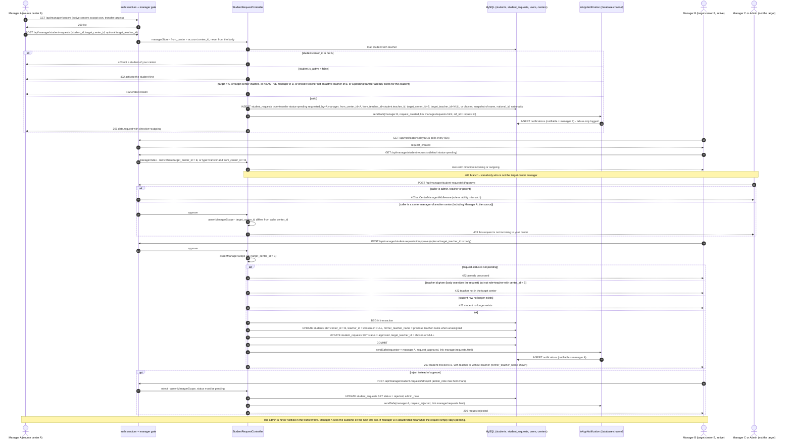

<details><summary>PlantUML source</summary>

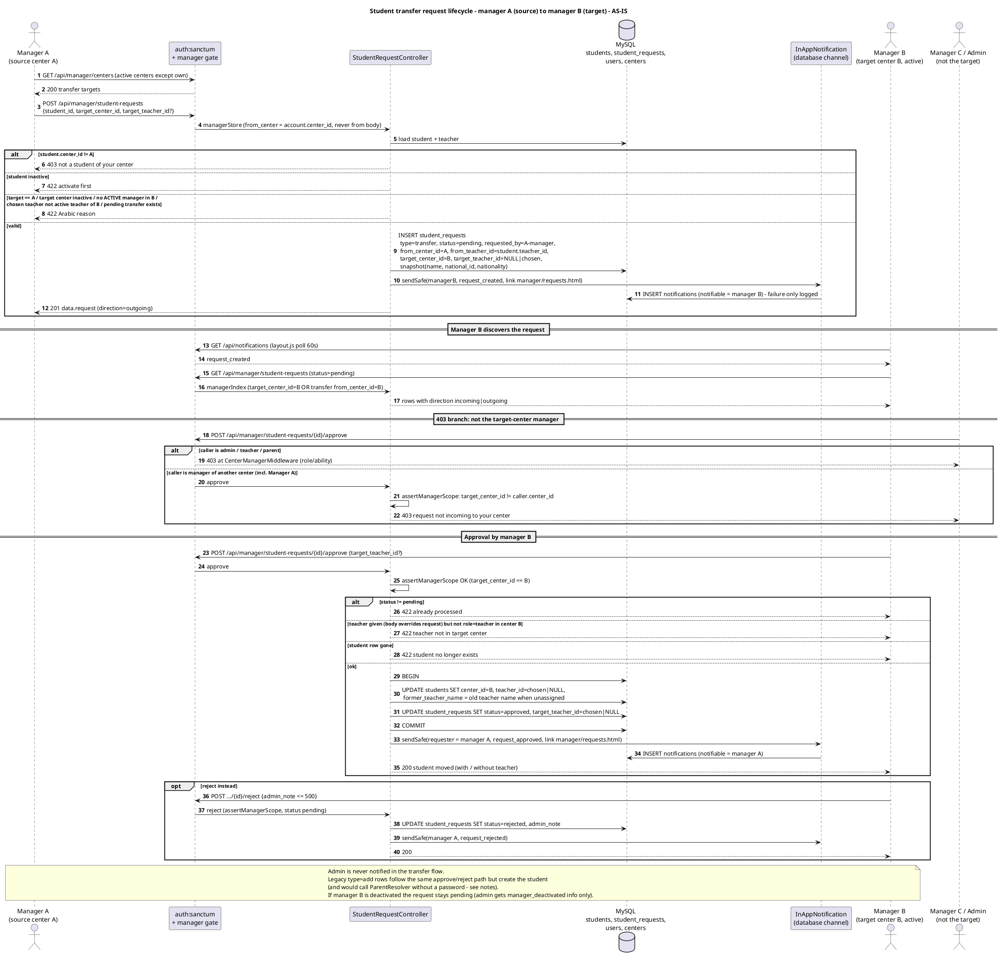

</details>

## 07 - State - StudentRequest status, Student / User / Center active-inactive, Sanctum token, with revocation side effects

_state_ · PlantUML source: [`07-state-studentrequest-status-student-user-center-active-inact.puml`](../architecture/plantuml/07-state-studentrequest-status-student-user-center-active-inact.puml)

Token-revocation side effects verified in: User::recordPasswordChange() (tokens()->delete()), TeacherController::toggleStatus, CenterManagerController::toggleTeacherStatus, ManagerManagementController::toggleStatus, CenterController::toggleStatus (loops all users with center_id). Student deactivation has no token side effect (students are not users). Parents can only be deactivated indirectly - there is no parent toggle endpoint (AdminUserController is read-only), so the User lifecycle for parents has no 'inactive' entry path in the API today. Reactivation never restores tokens. The 'primary teacher cannot be stopped' guard exists only on the manager path (toggleTeacherStatus), not on the admin TeacherController::toggleStatus.

```mermaid
stateDiagram-v2
    state "StudentRequest.status (student_requests)" as SR {
        [*] --> sr_pending : managerStore by source manager (type=transfer) or legacy add row
        sr_pending --> sr_approved : approve by a manager whose center_id = target_center_id (transaction moves student, sets target_teacher_id)
        sr_pending --> sr_rejected : reject by the same manager (admin_note optional)
        sr_pending --> sr_pending : target manager deactivated - request stays pending, admin gets manager_deactivated info only
        sr_approved --> [*]
        sr_rejected --> [*]
    }
    state "pending" as sr_pending
    state "approved (terminal, re-approve = 422)" as sr_approved
    state "rejected (terminal, re-reject = 422)" as sr_rejected

    state "Student (students.is_active) - no hard delete" as ST {
        [*] --> st_active : POST /students (admin) or /manager/students (manager) - display_code S n reserved atomically
        st_active --> st_inactive : PUT .../students/id/status is_active=false (status_changed_by, status_changed_at)
        st_inactive --> st_active : PUT .../students/id/status is_active=true
        st_active --> st_active : transfer approved (center_id and teacher_id change) or changeTeacher (teacher_id may become NULL, former_teacher_name kept)
    }
    state "active" as st_active
    state "inactive - out of attendance, xlsx import, reports and default lists; history kept" as st_inactive

    state "User account (users.is_active) - teacher, center_manager, parent" as US {
        [*] --> u_active : created by admin or manager (T n / CA n / P n code, generated e-mail)
        u_active --> u_inactive : toggleStatus false (admin for teacher or manager, manager for own-center teacher; the only primary teacher cannot be stopped) THEN all tokens deleted
        u_inactive --> u_active : toggleStatus true - user must log in again
        u_active --> u_active : password changed via OTP, self or admin - recordPasswordChange THEN all tokens deleted
        u_inactive --> u_inactive : login attempt returns 403 account inactive
    }
    state "active" as u_active
    state "inactive" as u_inactive

    state "Center (centers.is_active)" as CE {
        [*] --> c_active : POST /centers (admin) - display_code C n
        c_active --> c_inactive : PUT /centers/id/status false THEN tokens of every user with this center_id deleted (teachers + manager), their login returns 403
        c_inactive --> c_active : PUT /centers/id/status true - members log in again
    }
    state "active" as c_active
    state "inactive" as c_inactive

    state "Sanctum token (personal_access_tokens)" as TK {
        [*] --> tk_issued : login OK - abilities by role, expires_at = now + 7 days
        tk_issued --> tk_revoked : logout (this token) or user deactivated or center deactivated or password changed (all tokens of the user)
        tk_issued --> tk_expired : expires_at reached (10080 min)
        tk_revoked --> [*] : next request 401, client clears localStorage
        tk_expired --> [*] : next request 401
    }
    state "issued" as tk_issued
    state "revoked (row deleted)" as tk_revoked
    state "expired" as tk_expired
```

<details><summary>PlantUML source</summary>

```plantuml
@startuml MUTQEN_State_Lifecycles
title Lifecycles - StudentRequest, Student, User, Center, Sanctum token - AS-IS

state "StudentRequest.status\n(student_requests)" as SR {
  [*] --> pending : managerStore (type=transfer)\nor legacy add row
  pending --> approved : approve by manager with\ncenter_id == target_center_id\n(transaction: move student, set target_teacher_id)
  pending --> rejected : reject by same manager\n(admin_note optional)
  pending --> pending : target manager deactivated\nstays pending; admin gets\nmanager_deactivated (info only)
  approved --> [*]
  rejected --> [*]
  note right of approved : terminal - re-approve/reject => 422
}

state "Student (students.is_active)\nno hard delete" as ST {
  state "active" as st_active
  state "inactive\n(out of attendance, xlsx import,\nreports, default lists; history kept)" as st_inactive
  [*] --> st_active : POST /students (admin) or\nPOST /manager/students (manager)\nS{n} reserved atomically
  st_active --> st_inactive : PUT .../students/{id}/status false\n(status_changed_by/at)
  st_inactive --> st_active : PUT .../students/{id}/status true
  st_active --> st_active : transfer approved (center_id, teacher_id)\nor changeTeacher (teacher_id may be NULL,\nformer_teacher_name kept)
}

state "User account (users.is_active)\nteacher | center_manager | parent" as US {
  state "active" as u_active
  state "inactive" as u_inactive
  [*] --> u_active : created by admin/manager\nT{n}/CA{n}/P{n}, generated e-mail
  u_active --> u_inactive : toggleStatus false\n(admin: teacher/manager; manager: own-center teacher,\nthe only primary teacher cannot be stopped)\n=> tokens()->delete()
  u_inactive --> u_active : toggleStatus true\n(user logs in again)
  u_active --> u_active : password changed (otp/self/admin)\nrecordPasswordChange => tokens()->delete()
  u_inactive --> u_inactive : login => 403 account inactive
}

state "Center (centers.is_active)" as CE {
  state "active" as c_active
  state "inactive" as c_inactive
  [*] --> c_active : POST /centers (admin), C{n}
  c_active --> c_inactive : PUT /centers/{id}/status false\n=> tokens of ALL users with center_id deleted\n(teachers + manager); their login => 403
  c_inactive --> c_active : PUT /centers/{id}/status true
}

state "Sanctum token\n(personal_access_tokens)" as TK {
  state "issued" as tk_issued
  state "revoked (row deleted)" as tk_revoked
  state "expired" as tk_expired
  [*] --> tk_issued : login OK, abilities by role,\nexpires_at = now + 7d
  tk_issued --> tk_revoked : logout (this token) |\nuser deactivated | center deactivated |\npassword changed (all tokens)
  tk_issued --> tk_expired : expires_at reached (10080 min)
  tk_revoked --> [*] : next request 401\nclient clears localStorage
  tk_expired --> [*] : next request 401
}
@enduml
```

</details>

## 08 - Deployment - cPanel shared host today + dashed TARGET (Flutter, FCM, queue worker, object storage, monitoring, SMS)

_deployment_ · PlantUML source: [`08-deployment-cpanel-shared-host-today-dashed-target-flutter-fc.puml`](../architecture/plantuml/08-deployment-cpanel-shared-host-today-dashed-target-flutter-fc.puml)

AS-IS derived from .cpanel.yml (DEPLOYPATH=/home/[redacted-cpanel-user]/public_html; two rsync tasks with --delete; excludes vendor, .env, storage, bootstrap/cache; then rm bootstrap/cache/*.php), backend/.htaccess (Require all denied) and backend/public/.htaccess (Require all granted + Laravel rewrite), config.js (relative /backend/public/api in prod), DEPLOYMENT.md and n8n/README.md. Consequences worth stating: composer install and .env/storage provisioning are manual host steps; nothing runs php artisan migrate or config:cache on deploy; there is no cron, queue worker or scheduler (routes/console.php only has 'inspire', no ShouldQueue classes) even though .env.example sets QUEUE_CONNECTION=database; backups are a manual mysqldump recommendation. DEPLOYMENT.md tells to replace cors allowed_origins ['*'] but config/cors.php already reads from env; in prod the API is same-origin so CORS is moot. TARGET elements (Flutter, FCM, queue worker, Redis, object storage, monitoring, SMS gateway, optional VPS) are proposals, not code.

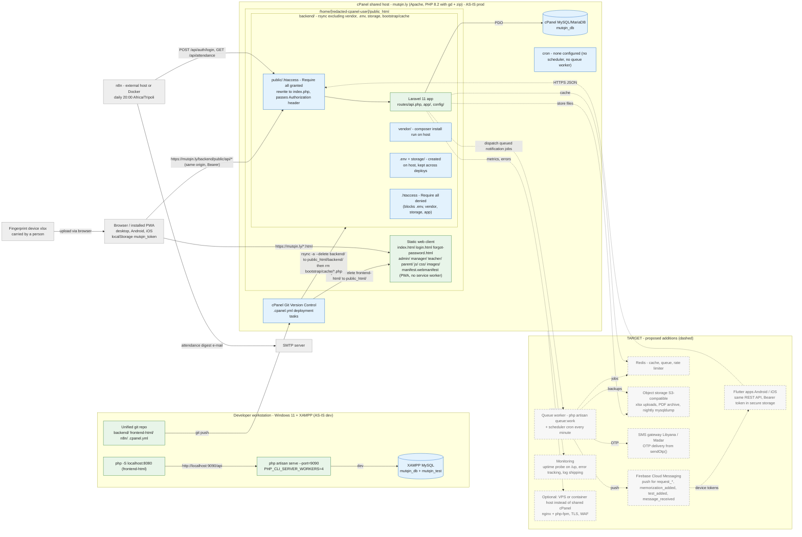

<details><summary>PlantUML source</summary>

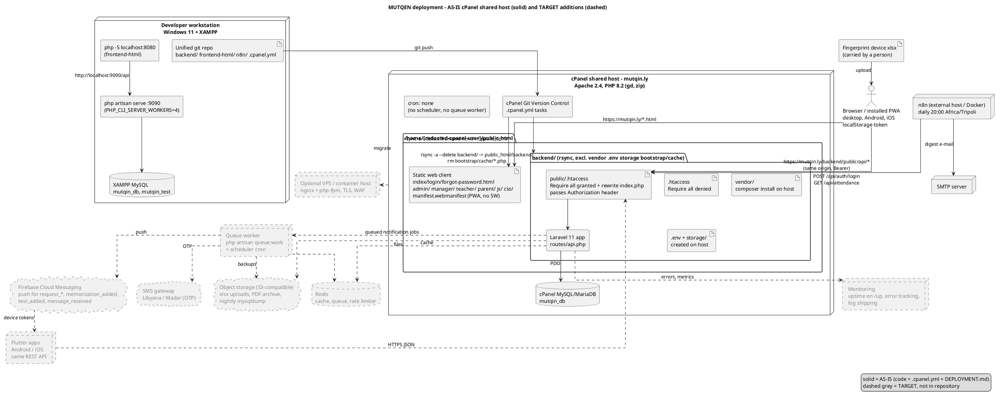

</details>

## 09 - PROPOSED TO-BE - modular monolith component diagram (bounded contexts)

_component-tobe_ · PlantUML source: [`09-proposed-to-be-modular-monolith-component-diagram-bounded-co.puml`](../architecture/plantuml/09-proposed-to-be-modular-monolith-component-diagram-bounded-co.puml)

PROPOSED, not code. The eight bounded contexts map onto today's controllers as follows: Identity&Access <- AuthController, TeacherProfileController, AdminUserController, ManagerManagementController(account part), middleware, DisplayCode, LoginEmail; Centers&Staff <- CenterController, TeacherController, CenterManagerController(staff part), PrimaryTeacherRule; Students&Guardians <- StudentController, ParentResolver; Attendance <- AttendanceController, AttendanceImportController, CenterManagerController(attendance review); Memorization&Assessment <- MemorizationController, WeeklyTestController, AthmanController, SurahReference (+ dormant Revision/TajweedEvaluation); Requests&Workflow <- StudentRequestController; Messaging&Notifications <- MessageController, NotificationController, InAppNotification; Reporting <- ReportController, ReportPdfController, ReportService, DashboardController. Main deltas vs AS-IS: (a) the users table is shared by three contexts today (admin, staff, parents) - proposal keeps one table owned by IAM and exposes account creation via contract; (b) the synchronous InAppNotification::sendSafe calls scattered across five controllers become domain events with queued listeners (needs the queue worker from the TARGET deployment); (c) token revocation on deactivate/center-deactivate/password-change becomes a single IAM listener instead of four copies of tokens()->delete(); (d) StudentRequest::approve stops writing students directly and calls Students.moveToCenter(); (e) n8n gets a service token instead of a human password.

```mermaid
flowchart TB
    classDef mod fill:#e3f2fd,stroke:#1565c0,color:#222
    classDef db fill:#fafafa,stroke:#757575,color:#222
    classDef shared fill:#fff8e1,stroke:#f9a825,color:#222
    classDef ext fill:#f5f5f5,stroke:#9e9e9e,color:#444
    classDef banner fill:#ffebee,stroke:#c62828,color:#b71c1c,font-weight:bold

    BANNER["PROPOSED TO-BE - not implemented. One Laravel deployable, app/Modules/* with each module owning its tables, exposing a small public contract, and talking to other modules only via contracts or domain events"]:::banner

    subgraph EDGE["Edge - thin HTTP layer"]
        ROUTES["Per-module route files merged into /api<br/>same envelope, same middleware chain (auth:sanctum + role gates), API versioning /api/v1"]:::shared
        CLIENTS["Clients: static web client, Flutter apps, n8n (service token)"]:::ext
    end

    subgraph IAM["Identity and Access"]
        IAM_API["Contract: authenticate(login,password), issueToken(role abilities), revokeAllTokens(userId), currentUser(), resetPasswordByOtp(), changePassword(), userDirectory()"]:::mod
        IAM_DOM["Domain: User (role, is_active), RoleGate policy (role AND ability), TokenPolicy (7d), PasswordChange audit, OtpReset, DisplayCode + LoginEmail generators"]:::mod
        IAM_DB[("users, personal_access_tokens, otp_resets, password_change_logs, code_sequences")]:::db
    end

    subgraph CEN["Centers and Staff"]
        CEN_API["Contract: centers CRUD + toggle, teachers CRUD + toggle, managers CRUD + toggle, assertPrimaryTeacherRule(), staffOfCenter(centerId)"]:::mod
        CEN_DOM["Domain: Center, Teacher (type primary/assistant), CenterManager (one per center), PrimaryTeacherRule under lock"]:::mod
        CEN_DB[("centers, users rows with role teacher/center_manager - owned jointly with IAM via contract")]:::db
    end

    subgraph STU["Students and Guardians"]
        STU_API["Contract: enroll(), update(), toggle(), changeTeacher(), moveToCenter(studentId, centerId, teacherId), resolveGuardian(), childrenOf(parentId), searchNormalized()"]:::mod
        STU_DOM["Domain: Student (is_active, former_teacher_name), Guardian resolution (id_number then phone then email), nationality rules, ArabicText search"]:::mod
        STU_DB[("students, users rows with role parent")]:::db
    end

    subgraph ATT["Attendance"]
        ATT_API["Contract: record(), importXlsx(centerScope), correct(), dailyList(date), monthlyReport()"]:::mod
        ATT_DOM["Domain: Attendance (unique per student and day), import parser, correction audit, active-students-only filter"]:::mod
        ATT_DB[("attendances")]:::db
    end

    subgraph MEM["Memorization and Assessment"]
        MEM_API["Contract: recordMemorization(), deleteMemorization(), recordWeeklyTest(), updateWeeklyTest(), progressOf(studentIds), surahs(), athmanSearch()"]:::mod
        MEM_DOM["Domain: SurahReference (juz from surah name), thumn tests with per-thumn questions, future Revision and Tajweed evaluation"]:::mod
        MEM_DB[("memorizations, weekly_tests, weekly_test_questions, revisions, tajweed_evaluations, athman")]:::db
    end

    subgraph REQ["Requests and Workflow"]
        REQ_API["Contract: createTransfer(), approve(), reject(), incomingOf(centerId), outgoingOf(centerId)"]:::mod
        REQ_DOM["Domain: StudentRequest state machine pending -> approved | rejected, target-center-manager authority, snapshot of student data"]:::mod
        REQ_DB[("student_requests")]:::db
    end

    subgraph MSGN["Messaging and Notifications"]
        MSG_API["Contract: sendMessage(), threadsOf(user), notify(userIds, type, payload), markRead()"]:::mod
        MSG_DOM["Domain: Message thread per student between parent and actual teacher, Notification (in-app now, push + SMS + e-mail channels later, queued)"]:::mod
        MSG_DB[("messages, notifications, device_tokens (new)")]:::db
    end

    subgraph REP["Reporting"]
        REP_API["Contract: studentReport(), teacherReport(), centerReport(), atRisk(), overview(), pdf(view, scope)"]:::mod
        REP_DOM["Read-only module: queries other modules through read contracts or read models, mPDF rendering, Percentage helper, active-centers filter, week Saturday to Friday"]:::mod
    end

    subgraph KERNEL["Shared kernel (no business rules)"]
        K1["ArabicText, PhoneNumber, Percentage, DisplayCode primitives, Envelope response, Arabic validation messages, timezone Africa/Tripoli"]:::shared
        BUS["Domain event bus (Laravel events, queued listeners)"]:::shared
    end

    CLIENTS --> ROUTES
    ROUTES --> IAM_API
    ROUTES --> CEN_API
    ROUTES --> STU_API
    ROUTES --> ATT_API
    ROUTES --> MEM_API
    ROUTES --> REQ_API
    ROUTES --> MSG_API
    ROUTES --> REP_API

    REQ_API -- "moveToCenter()" --> STU_API
    REQ_API -- "staffOfCenter() to validate target teacher" --> CEN_API
    STU_API -- "resolveGuardian creates parent user via IAM contract" --> IAM_API
    CEN_API -- "create teacher / manager accounts" --> IAM_API
    ATT_API -- "active students of scope" --> STU_API
    MEM_API -- "student ownership check" --> STU_API
    REP_API -. "read models" .-> ATT_API
    REP_API -. "read models" .-> MEM_API
    REP_API -. "read models" .-> STU_API
    REP_API -. "read models" .-> CEN_API

    REQ_DOM -. "TransferRequested, TransferApproved, TransferRejected" .-> BUS
    MEM_DOM -. "MemorizationRecorded, WeeklyTestRecorded" .-> BUS
    MSG_DOM -. "MessageSent" .-> BUS
    CEN_DOM -. "CenterDeactivated, TeacherDeactivated, ManagerDeactivated" .-> BUS
    IAM_DOM -. "PasswordChanged, UserDeactivated" .-> BUS
    BUS -. "notify parent / manager / requester" .-> MSG_API
    BUS -. "revokeAllTokens for user or center members" .-> IAM_API

    IAM_API --> IAM_DB
    CEN_API --> CEN_DB
    STU_API --> STU_DB
    ATT_API --> ATT_DB
    MEM_API --> MEM_DB
    REQ_API --> REQ_DB
    MSG_API --> MSG_DB
```

<details><summary>PlantUML source</summary>

```plantuml
@startuml MUTQEN_TOBE_Modular_Monolith
title PROPOSED TO-BE - MUTQEN modular monolith (single Laravel deployable, app/Modules/*) - NOT IMPLEMENTED
skinparam componentStyle rectangle
skinparam linetype ortho

note as N0
  PROPOSED. Each module owns its tables and exposes a small public contract;
  cross-module calls go through contracts (solid) or domain events (dashed).
  Middleware chain (auth:sanctum + role AND ability gates) and the JSON envelope stay unchanged.
end note

package "Edge - thin HTTP layer" {
  [Per-module routes merged under /api/v1\nsame envelope, same middleware chain] as routes
  [Clients: static web client, Flutter apps,\nn8n with a service token] as clients
}

package "Identity & Access" as IAM {
  interface "authenticate / issueToken(role abilities)\nrevokeAllTokens / currentUser\nresetPasswordByOtp / changePassword / userDirectory" as iam_c
  [User, RoleGate (role AND ability), TokenPolicy 7d,\nPasswordChange audit, OtpReset,\nDisplayCode + LoginEmail generators] as iam_d
  database "users, personal_access_tokens,\notp_resets, password_change_logs,\ncode_sequences" as iam_db
}

package "Centers & Staff" as CEN {
  interface "centers / teachers / managers CRUD + toggle\nassertPrimaryTeacherRule / staffOfCenter" as cen_c
  [Center, Teacher (primary|assistant),\nCenterManager (one per center),\nPrimaryTeacherRule under lock] as cen_d
  database "centers\n(+ staff user rows via IAM contract)" as cen_db
}

package "Students & Guardians" as STU {
  interface "enroll / update / toggle / changeTeacher\nmoveToCenter(studentId, centerId, teacherId)\nresolveGuardian / childrenOf / searchNormalized" as stu_c
  [Student (is_active, former_teacher_name),\nGuardian resolution id_number > phone > email,\nnationality rules, ArabicText search] as stu_d
  database "students\n(+ parent user rows via IAM contract)" as stu_db
}

package "Attendance" as ATT {
  interface "record / importXlsx(centerScope) / correct\ndailyList(date) / monthlyReport" as att_c
  [Attendance (unique student+day),\nxlsx parser, correction audit,\nactive-students filter] as att_d
  database "attendances" as att_db
}

package "Memorization & Assessment" as MEM {
  interface "recordMemorization / deleteMemorization\nrecordWeeklyTest / updateWeeklyTest\nprogressOf(studentIds) / surahs / athmanSearch" as mem_c
  [SurahReference (juz from surah name),\nthumn tests + questions,\nfuture Revision & Tajweed] as mem_d
  database "memorizations, weekly_tests,\nweekly_test_questions, revisions,\ntajweed_evaluations, athman" as mem_db
}

package "Requests & Workflow" as REQ {
  interface "createTransfer / approve / reject\nincomingOf(centerId) / outgoingOf(centerId)" as req_c
  [StudentRequest state machine\npending -> approved | rejected,\ntarget-center-manager authority,\nstudent snapshot] as req_d
  database "student_requests" as req_db
}

package "Messaging & Notifications" as MSG {
  interface "sendMessage / threadsOf(user)\nnotify(userIds, type, payload) / markRead" as msg_c
  [Message thread per student (parent <-> actual teacher),\nNotification: in-app now; push (FCM), SMS, e-mail\nchannels later via queued listeners] as msg_d
  database "messages, notifications,\ndevice_tokens (new)" as msg_db
}

package "Reporting (read-only)" as REP {
  interface "studentReport / teacherReport / centerReport\natRisk / overview / pdf(view, scope)" as rep_c
  [Read models over other modules,\nmPDF rendering, Percentage,\nactive-centers filter, week Sat-Fri] as rep_d
}

package "Shared kernel (no business rules)" as KER {
  [ArabicText, PhoneNumber, Percentage,\nEnvelope response, Arabic validation messages,\ntimezone Africa/Tripoli] as k1
  queue "Domain event bus\n(Laravel events, queued listeners)" as bus
}

clients --> routes
routes --> iam_c
routes --> cen_c
routes --> stu_c
routes --> att_c
routes --> mem_c
routes --> req_c
routes --> msg_c
routes --> rep_c

iam_c - iam_d
cen_c - cen_d
stu_c - stu_d
att_c - att_d
mem_c - mem_d
req_c - req_d
msg_c - msg_d
rep_c - rep_d
iam_d --> iam_db
cen_d --> cen_db
stu_d --> stu_db
att_d --> att_db
mem_d --> mem_db
req_d --> req_db
msg_d --> msg_db

req_d --> stu_c : moveToCenter()
req_d --> cen_c : staffOfCenter() (validate target teacher)
stu_d --> iam_c : create parent account
cen_d --> iam_c : create teacher / manager accounts
att_d --> stu_c : active students of scope
mem_d --> stu_c : ownership check
rep_d ..> att_c : read models
rep_d ..> mem_c : read models
rep_d ..> stu_c : read models
rep_d ..> cen_c : read models

req_d ..> bus : TransferRequested / Approved / Rejected
mem_d ..> bus : MemorizationRecorded / WeeklyTestRecorded
msg_d ..> bus : MessageSent
cen_d ..> bus : CenterDeactivated / TeacherDeactivated / ManagerDeactivated
iam_d ..> bus : PasswordChanged / UserDeactivated
bus ..> msg_c : notify parent / manager / requester
bus ..> iam_c : revokeAllTokens (user or center members)
@enduml
```

</details>

